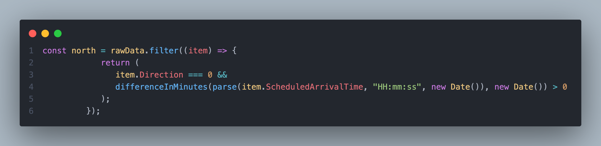

# addEventListener

## Question

> "click" 、 「,」 、 ()
> 到底是什麼意思 逗號 我能理解是 "click" 之後 嗎？
> 還是他是分開的 概念？？

## ref

> 有時候你要函式處理的參數並不是最終參數，一起丟就會很方便
>
> 舉個例子，我自己碰到的狀況是 API 回傳的資料，時間欄位給的是 String ，但我有時間計算的排序、過濾需求，如果分開來處理，我需要把時間欄位的資料單獨拉出來計算之後再整合回去，但如果用函式嵌套的話，我可以濃縮成一行放在輸出的時候一起處理
>
> 最後 , 逗號在程式裡主要的功用跟文法基本上是一樣的，都是為了區隔開來，不管是函式的複數參數或是陣列裡區隔 index 的識別，或是 package.json 這種描述檔是用來區別行數欄位的

> 這行的狀況就是我用了 date-fns 的套件，套了一個 parse 將 string 轉變成 date 型別 return 到 `differenceInMinutes`這個函式把轉換後的時間做比較看是不是大於 0

> 配上前面的 item.Direction 最終輸出狀況是，火車資料分類出南下還是北上，班次時間是不是超過現在時間，如果答案是 true 那就把整個班次忽略掉
> 三件事情一行搞定，如果個別獨立寫的話，可能要 20 行
> 會可以這樣寫的原因是套進去的函式都有一個 return 所以呼叫之後成功執行我只會拿到處理後的結果，相當於也是一個參數了

> 但 括號是程式識別你寫的是不是一個 function 的重要依據，所以即便你不需要帶參數也一定要寫

> differenceInMinutes 也是帶了兩個參數進去，前後概念是減數和被減數的差別，後者我帶了一個 New Date 抓一次當前系統時間，兩者相減的結果如果是>0 代表還沒超時 XD

- [箭頭函式](https://wcc723.github.io/javascript/2017/12/21/javascript-es6-arrow-function/)
- [函式套函式，JavaScript 閉包](https://coolshell.cn/articles/6731.html)
