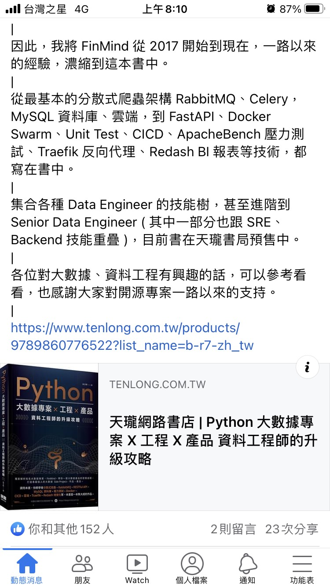

# FinMind

> 這本書應該還不錯，作者數學所背景，在業界任資料工程師，他做了開源專案(股市爬蟲相關)，用分散式架構架在 AWS 上，把整個專案實作寫成一本書。

> 這張圖上面的專案技術線
> 很值得去 google 看一遍
> 因為這是相對完整的軟體開發後端 stack
> RabbitMQ > message queue
> FastAPI > python 的 api 介面
> Docker Swarm > AWS 的微服務架構
> Unit Test > 單元測試
> CICD > 自動化工作流程(主要是把測試整合進去)
> 雖然前端面試通常不會問到這些
> 可是這些關鍵字稍微 google 看一下覺得還是會滿有幫助的

- [FinMind github](https://github.com/FinMind/FinMind?fbclid=IwAR2OX7in8kEQOGjIJqRttuL_EuV1i4Xrn0GZP6Re-yMw8aQUkRIAiZRIeQM)
